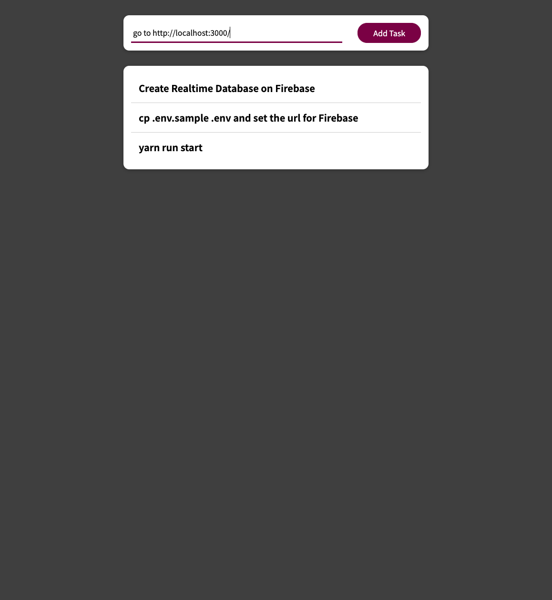

### React Custom Hook 

Custom hook to make http requests to Firebase, and store a Todo list.


#### Installation

1. Install dependencies

```
yarn install
```

2. Create you database on Firebase and get the url

[Firebase Console](https://console.firebase.google.com/)

3. Create your env file from sample one

```
cp .env.sample .env
```

4. Run your local app

```
yarn run start
```

5. Open your browser and go to 
```
http://localhost:3000/
```